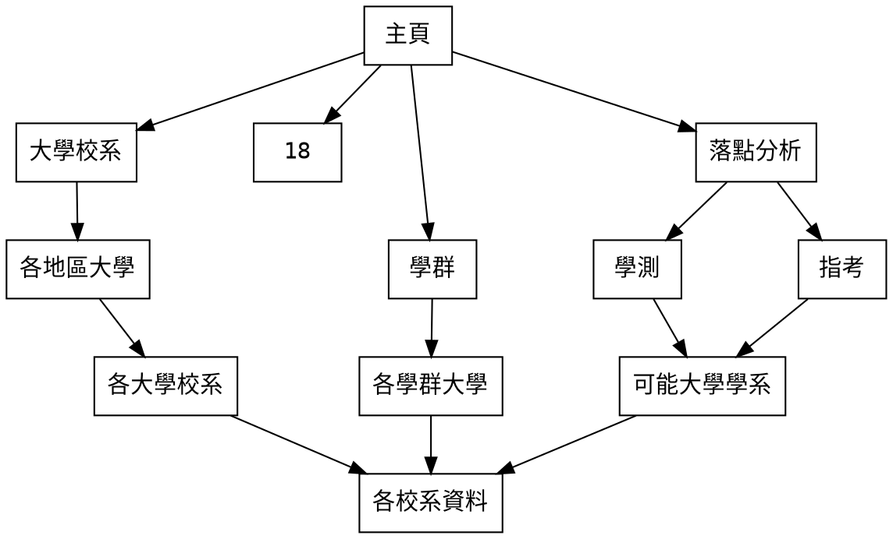

# DB-TEAMLAB
<註解: 統一用 "XXXX(日期), OOO(名子), (做了甚麼事情)"來寫>
## 0418討論內容
### 主題：大學系所介紹
### 架構說明：

- 買家搜尋:
    1.	使用者可以透過網站上的搜尋關鍵字來尋找各網站不同的商品
    2.	依照商品連結網站做成表格
    3.	資料進行分析 (eg. 按照價格排序、按照商品分組、價格範圍限制、賣場限制、顯示幾筆……)
    4.	將搜尋的紀錄寫入資料庫內
    5.	呈現回網站
- 賣家上架:
    1.	在網站端填寫好所需資料 (名稱、分類、價格……)之後寫入資料庫
    2.	網站呈現填寫結果
- 問題:
    1.	各網站的網站架構不一，要為不同平台建立自己的程式
    2.	市面商品的名稱不一，有時候商品上的訊息過多冗言贅字 (eg. 免運、銷量第一)，可能會影響搜尋關聯性的呈現
- 進度:
    1.	先試圖爬看看網站，看整理出的表格能有怎樣的訊息。

## 0418進度
- 爬蟲測試 (李茵淇)
    1. 做出來可以成功，目前指導出第一頁，所以看有沒有要繼續新增頁面
    2. PCHOME擋的情況比較嚴重還沒做出來
>*有關爬蟲的部分: 只要下載.py檔就好了，pchome的網站我還沒成功，欄位的部分目前還在想要不要繼續新增，大家可以想想看*
